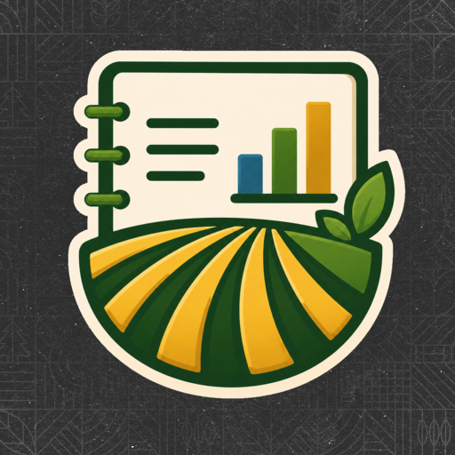
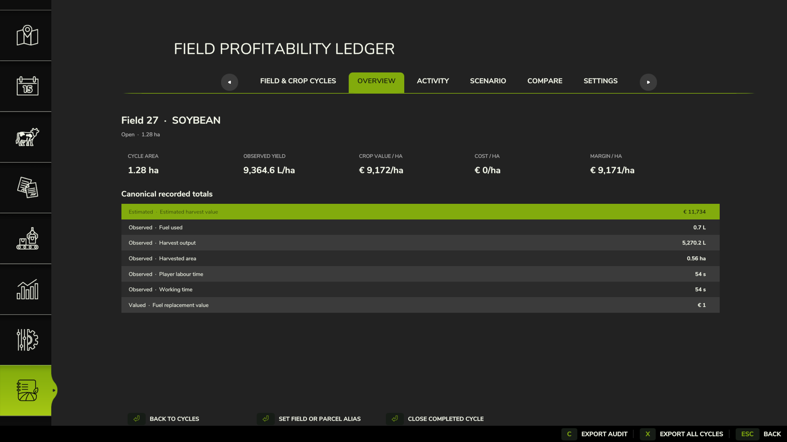
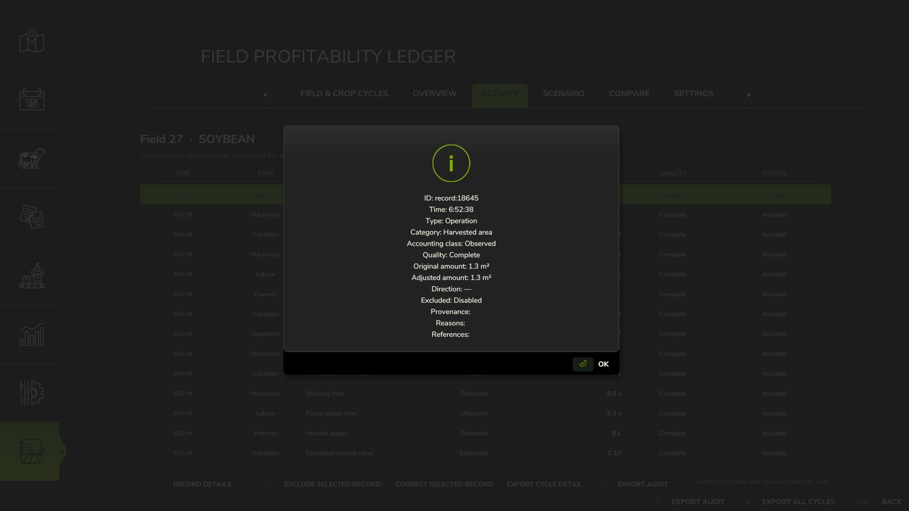
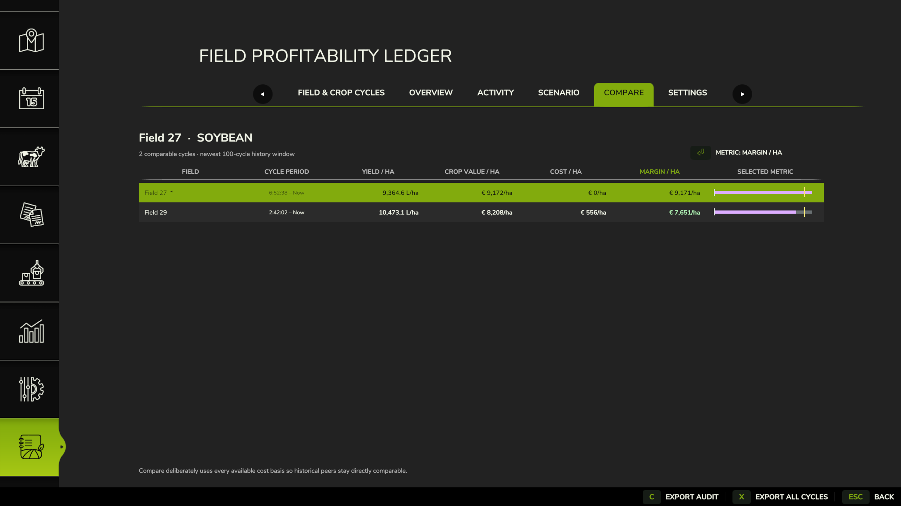
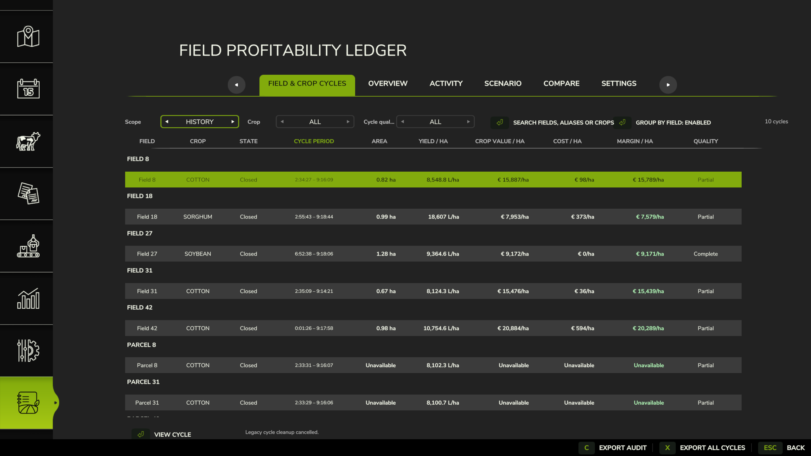

<p align="center">
  
</p>

<h1 align="center">Field Profitability Ledger</h1>

<p align="center">
  Find out what each field earns — and what it costs to get there.
</p>

<p align="center">
  <a href="https://github.com/user01010111/FS25_FieldProfitabilityLedger/releases/tag/v0.1.0-beta.1"></a>
  
  
  <a href="LICENSE"></a>
</p>

Field Profitability Ledger (FPL) follows work, inputs, harvests, machinery and
labour for each field and crop cycle. It turns that activity into useful
figures such as yield per hectare, cost per hectare and projected margin.

Use it to compare fields, understand where your money is going and keep a
lasting history of your farm.

The in-game interface is available in English and German. Other game
languages use the English interface.

[Download Beta 1](https://github.com/user01010111/FS25_FieldProfitabilityLedger/releases/download/v0.1.0-beta.1/FS25_FieldProfitabilityLedger.zip)
· [Report a problem](https://github.com/user01010111/FS25_FieldProfitabilityLedger/issues)

> **Public beta:** This release is ready for wider testing. Feedback from
> different maps, equipment and mod collections will help shape the first
> stable release.



## What you can do

- Follow open crop cycles and review completed ones
- See yield, crop value, costs and projected margin by hectare
- Review field activity in time order
- Compare fields growing the same crop
- Include or exclude different cost types from your projections
- Name fields and player-created parcels with your own aliases
- Correct or exclude individual records without losing the original entry
- Close completed cycles manually or clean up older harvested cycles in bulk
- Export cycle summaries, detailed activity and audit records to CSV

## Install

1. Close Farming Simulator 25.
2. Download `FS25_FieldProfitabilityLedger.zip` from the
   [latest beta release](https://github.com/user01010111/FS25_FieldProfitabilityLedger/releases/tag/v0.1.0-beta.1).
3. Copy the ZIP into your Farming Simulator 2025 `mods` folder.
4. Leave the ZIP packed and keep its filename unchanged.
5. Enable **Field Profitability Ledger** when loading your single-player save.

Typical FS25 profile locations:

- Windows: `Documents/My Games/FarmingSimulator2025`
- macOS: `~/Library/Application Support/FarmingSimulator2025`

Back up an important save before adding or updating any script mod.

### Updating

Close FS25 and replace the existing `FS25_FieldProfitabilityLedger.zip` with
the new download. Your ledger history is stored with the savegame and carries
over when the mod is updated.

### Removing

Close FS25 and remove `FS25_FieldProfitabilityLedger.zip` from the `mods`
folder. Back up the save first if you may want its FPL history later.

## Quick start

1. Load a single-player save with FPL enabled.
2. Press `Alt+L` to open the ledger.
3. FPL opens on **Field & Crop Cycles** with **Current** selected.
4. Select a field and choose **View cycle**.
5. Open **Overview** for the main figures.
6. Open **Activity** to see how those figures were built up.
7. Use **Scenario** to choose which costs appear in Cost/ha and Margin/ha.
8. Use **Compare** to rank fields growing the same crop.
9. Save the game normally. FPL history is saved with it.

`Alt+L` appears in the controls menu as **Open Field Profitability Ledger** and
can be rebound.

## The FPL screens

### Field & Crop Cycles

This is the main screen. It shows:

- Field or parcel
- Crop
- Open, Closed or Archived state
- Cycle period
- Area
- Yield/ha
- Crop value/ha
- Cost/ha
- Margin/ha
- Data quality

Select a column heading to sort by it. Select it again to reverse the order.
Rows without a figure are placed after rows that can be compared.

Use the controls above the table to:

- switch between **Current**, **History** and **All** cycles;
- filter by crop or data quality;
- search field names, aliases and crops; and
- group History by field.

History opens grouped by field. Turn grouping off when you want one overall
profitability ranking. Search and filters reset when the menu is reopened,
while your chosen sort order is remembered.

The list scrolls normally, so every cycle remains reachable. Opening a cycle
and returning to the list keeps your previous selection.

### Overview

Overview gives you the headline figures for the selected cycle:

- Area
- Yield/ha
- Crop value/ha
- Cost/ha
- Margin/ha

The table underneath breaks the cycle down into harvested output, field work,
inputs, machinery, labour, costs and crop value. This screen also contains the
field alias and manual cycle-closure actions.

### Activity

Activity is the line-by-line history of the selected cycle, shown in time
order. Select a row and choose **Record details** to see its amount, time,
quality, source and any notes.

From this screen you can also:

- add a correction;
- exclude a record from totals;
- export the selected cycle's details; or
- export its correction and exclusion history.

A correction adds a clearly marked adjustment. Excluding a record removes it
from calculations but leaves it available for review.



### Scenario

Scenario lets you decide which recorded costs belong in the projection:

- Direct costs
- Replacement-valued inputs
- Replacement-valued fuel
- Replacement-valued DEF
- Allocated costs

Changes appear immediately in Scenario and in the main cycle table's Cost/ha
and Margin/ha columns. They change the view only; they do not remove activity
from the ledger.

### Compare

Compare ranks other cycles for the same crop and farm by:

- Margin/ha
- Yield/ha
- Cost/ha
- Crop value/ha

It also shows the farm average and the selected field's difference from that
average.

For a fair historical comparison, Compare includes every available cost type
for each cycle. It does not follow the switches currently selected in
Scenario.



### Settings

Settings contains:

- CSV order: newest first or oldest first
- Visibility of excluded Activity rows
- Game and save status
- Ledger storage status
- Legacy open-cycle cleanup

Legacy cleanup helps with harvested cycles left open by older FPL versions.
Select the cycles you want to close, review them, then confirm by typing
`CLOSE`.

## How crop cycles work

A crop cycle gathers the work and results for one field or parcel from
preparation through harvest.

FPL does not close a cycle the moment harvesting stops. It waits until later
field work shows that the next cycle has begun. This avoids splitting one crop
cycle because the game was paused, saved or restarted.

A new cycle begins when, for example:

- work starts after a recorded harvest;
- a different crop is established; or
- the same crop is sown again after harvest.

You can close a completed cycle yourself from Overview. Closing a cycle moves
it into History and does not delete its records.

**Closed** is normal completed history. **Archived** is used for much older
history that has been condensed to save space. Archived cycles keep their
important totals, although some older line-by-line detail may no longer be
available.



## Understanding the numbers

### Main figures

| Figure | How it is worked out |
|---|---|
| **Area** | The area of the field or parcel linked to the cycle. |
| **Yield/ha** | Recorded harvest output divided by recorded harvested area. |
| **Crop value/ha** | Expected crop value divided by cycle area. |
| **Cost/ha** | Costs selected in Scenario divided by cycle area. |
| **Margin/ha** | Projected margin divided by cycle area. |
| **Projected margin** | Expected crop value minus the costs selected in Scenario. |
| **Farm average** | The average available result from comparable cycles growing the same crop. |

Projected margin is a planning figure, not your final sale profit. Crops may
later be stored, processed, fed to animals or sold at another price.

### Where amounts come from

FPL labels figures so you can tell how they were obtained:

| Label | Meaning |
|---|---|
| **Observed** | Directly measured activity, time, area, input or output. |
| **Direct** | A recorded cash cost tied to the field, such as supported helper wages. |
| **Valued** | A measured quantity given a replacement value, such as seed or diesel. |
| **Allocated** | A share of a wider cost, such as lease use, repair wear or fallback helper labour. |
| **Estimated** | A calculated planning figure, such as expected crop value or projected margin. |

Prices used for valued and estimated entries are saved with the record, so
later price changes do not rewrite earlier cycles.

### Data quality

| Quality | Meaning |
|---|---|
| **Complete** | FPL had everything needed for that record or figure. |
| **Partial** | The result is useful, but some information was missing or uncertain. |
| **Unsupported** | The game or another mod did not provide the information FPL needed. |

**Unavailable** is different from zero. It means FPL could not calculate that
particular figure from the information it received.

## What FPL tracks

### Field work

- Plowing and subsoiling
- Cultivation, disc harrowing and power harrowing
- Mulching and stone picking
- Seeding and planting
- Rolling and mechanical weeding
- Fertilizer, lime and herbicide application
- Manure, slurry and digestate application
- Supported crop harvesting

### Inputs, machinery and labour

- Seed
- Solid and liquid fertilizer
- Lime and herbicide
- Manure, slurry and digestate
- Diesel and DEF
- Working time
- Damage and wear
- AI and player working time
- Supported helper wages and helper-autobuy diesel charges
- Lease-use and repair-wear allocations

FPL records player working time but does not assign it a cash wage. It also
does not add vehicle ownership or depreciation costs.

### Supported harvest crops

FPL supports these 23 base-game crops and outputs:

wheat, barley, canola, oat, maize, sunflower, soybean, potato, rice,
long-grain rice, sugar beet, sugarcane, cotton, sorghum, grape, olive, poplar,
beetroot, carrot, parsnip, green bean, pea and spinach.

Poplar is recorded as woodchips. Grass establishment and field inputs can be
recorded, but mowing and later forage work are not currently included.

### Fields and player-created parcels

Standard fields use their normal field number. Work on owned field ground
outside a standard field can appear as a player-created parcel.

If one pass crosses a field boundary and FPL cannot confidently place it on a
single field, it is shown as Partial and left out of profitability totals.

## CSV exports

Exports are saved in:

`modSettings/FS25_FieldProfitabilityLedger/exports`

| File | What it contains |
|---|---|
| `FieldProfitabilityLedger_cycles.csv` | All cycle summaries and totals. |
| `FieldProfitabilityLedger_cycle_records.csv` | Detailed Activity rows for the selected cycle. |
| `FieldProfitabilityLedger_cycle_audit.csv` | Corrections and exclusions for the selected cycle. |

Use **Export all cycles** from the main table. Use **Export cycle detail** or
**Export audit** after selecting a cycle.

Each new export replaces the previous file with the same name. Choose
newest-first or oldest-first CSV ordering in Settings.

## Saving, backups and privacy

FPL history is stored in `fieldProfitabilityLedger.xml` inside the savegame.
Copying or restoring the whole savegame also copies or restores its ledger.

FPL settings and CSV exports are stored separately in
`modSettings/FS25_FieldProfitabilityLedger`.

FPL does not connect to the internet or send telemetry.

## Compatibility

- Farming Simulator 25 on PC or Mac
- Single-player only
- Base-game field work, inputs and crops listed above

Multiplayer and dedicated servers are not supported.

FPL does not currently include dedicated support for Precision Farming,
Courseplay, AutoDrive or custom crop systems. A modded map, vehicle or
implement may still work when it uses the same game systems as the supported
base-game equipment.

The following are outside the current release:

- Production chains and animals
- Contracts
- Loans, tax and insurance
- Mowing, hay, straw, tedding, windrowing, bales and silage
- Sale-price matching after crops have been stored, mixed, processed or moved
- Most forestry work beyond the supported poplar output
- Multiplayer farms

FPL only observes and reports. It does not change field conditions,
application rates, crop growth, yields, vehicles or prices.

## Troubleshooting

### `Alt+L` does not open FPL

Check that FPL is enabled for the save. Open the FS25 controls menu and look
for **Open Field Profitability Ledger** in case the key was changed or
conflicts with another mod.

### Why is a figure unavailable?

FPL did not receive enough information to calculate it. Check Activity and the
quality label for more detail.

### Why is my harvested cycle still open?

FPL waits for the next field operation before deciding that a new cycle has
started. You can close the harvested cycle manually from Overview.

### Why is projected margin different from my bank balance?

Projected margin uses expected crop value and the cost types selected in
Scenario. It does not include unrelated farm spending or know what eventually
happened to every harvested litre.

### Why is a cost missing?

Some figures depend on the equipment, worker type and game system involved.
Check Activity to see what was recorded and whether any entries are Partial or
Unsupported.

### Will my modded map or equipment work?

Often, but not always. Include the map, crop, vehicle, implement and relevant
mod versions when reporting anything that looks wrong.

### What should I include in a bug report?

Please provide:

- FPL and FS25 versions
- Platform and map
- Field, crop and operation
- Vehicle and implement
- Whether an AI worker was active
- Other relevant mods
- Relevant `[FieldProfitabilityLedger]` lines from `log.txt`
- The name of any useful CSV export

Remove personal file paths before posting. Do not upload a savegame unless it
is requested.

## Build from source

The included builder requires Python 3.10 or newer:

```sh
python3 scripts/build_release.py
python3 scripts/build_release.py --verify build/FS25_FieldProfitabilityLedger.zip
```

To verify the official download:

```sh
sha256sum -c SHA256SUMS.txt
```

## Licence, trademarks and support

The source is publicly viewable under the proprietary terms in
[LICENSE](LICENSE). Permission to copy, modify or redistribute the project is
not granted.

Farming Simulator, GIANTS Software and related names and marks belong to their
respective owners. This project is not affiliated with or endorsed by GIANTS
Software.

For help or feedback, use
[GitHub Issues](https://github.com/user01010111/FS25_FieldProfitabilityLedger/issues).
